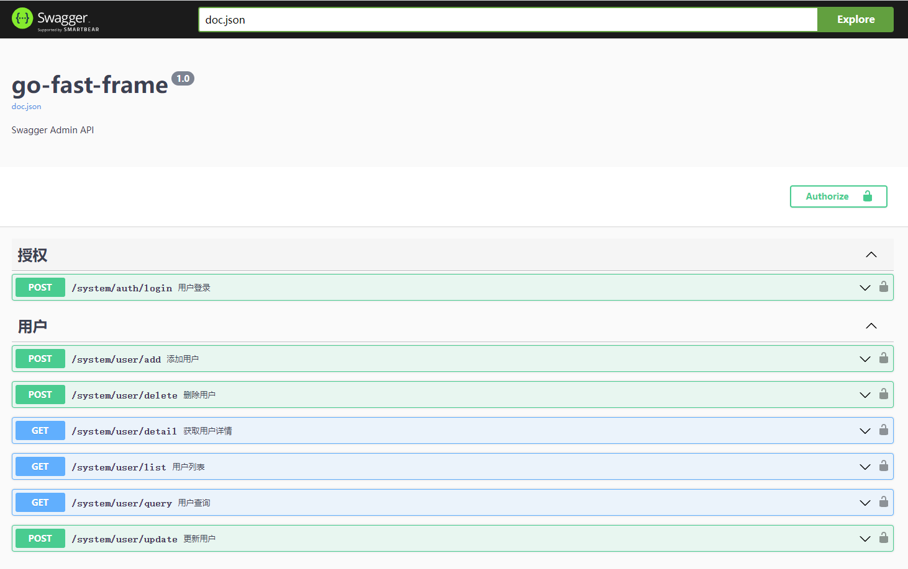

<div align=center>
	
    <h1>Go Fast Frame</h1>
    <h4>Go+Gin+Gorm快速搭建基础框架</h4>
</div>

## 介绍

GoFastFrame基于Go、Gin、Gorm快速搭建基础框架。当项目启动时，我们需要思考如何架构项目，我希望通过构建基础框架，为大家做项目提供参考。框架适用于大部分项目，可根据实际项目需要做调整。

如果对您有所帮助，您可以点 🌟Star 支持一下，谢谢~~

## 项目启动
```
# 初始化依赖
go mod init

# 启动项目
go run main.go
```

## 项目功能

* 初始化：配置文件、数据库、路由、Swagger
* 中间件：全局异常处理、跨域、Jwt验证
* Api接口：用户User（Query、Add、Update、Delete、Detail、List），授权Auth（Login）

## 目录结构

```
├── app                 (应用层)
│   ├── api             (API接口)
│   ├── dto             (数据传输对象)
│   └── service         (业务处理)
├── common              (公共文件)
│   ├── dto             (数据传输对象)
│   ├── tools           (第三方工具类，如：gorm、redis等)
│   └── utils           (工具类)
├── config              (配置文件)
├── constant            (常量/枚举)
├── docs                (swagger文档目录)
├── global              (全局对象)
├── middleware          (中间件)
├── model               (数据模型)
├── resources           (README资源图片)
├── router              (路由层)
├── go.mod              (相关依赖)
├── go.sum              (相关依赖)
└── main.go             (入口文件)
```

## API文档（Swagger）



## 📖帮助文档

* Gin https://gin-gonic.com/zh-cn/docs/
* Gorm https://gorm.io/zh_CN/docs/index.html

😎通过以上文档，你可以玩转本框架，如有问题可从文档中寻找解决办法。

